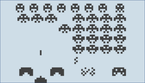
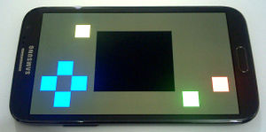

# Emulators for Gamebuino Classic

[Back to Home](./../../../README.MD) | [Go to Classic Reference Summary](./../reference/README.MD)

There are currently 4 Gamebuino emulators in development:

## gbsim

- Author: Deneth
- Forum Thread: [http://gamebuino.com/forum/viewtopic.php?f=12&t=506](http://gamebuino.com/forum/viewtopic.php?f=12&t=506)
- Download(s): [Debian/Ubuntu](https://github.com/33d/gbsim), [Windows](https://github.com/33d/gbsim-win)
- File format(s): ELF
- Open Source: Yes
- To run on Linux, open the Terminal and type the command

```
cd /path/to/gbsim/within/gbsim
```

and then type

```
./main.elf ./path/to/game.elf
```

## Simbuino

- Author: Myndale
- Forum Thread: [http://gamebuino.com/forum/viewtopic.php?f=12&t=1028](http://gamebuino.com/forum/viewtopic.php?f=12&t=1028)
- Download(s): [Windows (.NET 4.5)](https://github.com/Myndale/Simbuino/blob/master/binaries/Simbuino-Install.zip?raw=true)
- Hosted: [GitHub](https://github.com/Myndale/Simbuino)
- File format(s): HEX
- Open Source: Yes

## Simbuino4Web (HTML5)



- Author: Myndale
- Forum Thread: [http://gamebuino.com/forum/viewtopic.php?f=12&t=3408](http://gamebuino.com/forum/viewtopic.php?f=12&t=3408)
- Hosted: http://simbuino4web.ppl-pilot.com (unvailable)
- Source: [GitHub](https://github.com/Myndale/Simbuino/tree/master/src/Simbuino4Web)
- File format(s): HEX
- Open Source: Yes

## RetroMicro



- Author: blakewford
- Forum Thread: [http://gamebuino.com/forum/viewtopic.php?f=12&t=1381](http://gamebuino.com/forum/viewtopic.php?f=12&t=1381)
- Download(s): Android (4.0+) (unvailable)
- Hosted: starlo.org (unvailable)
- Source: [GitHub](https://github.com/blakewford/pichai)
- File format(s): HEX
- Open Source: Yes

## General information

Saved on September 30, 2023
