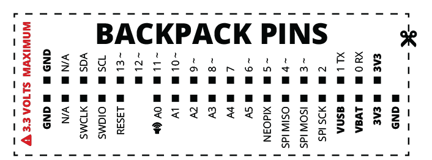
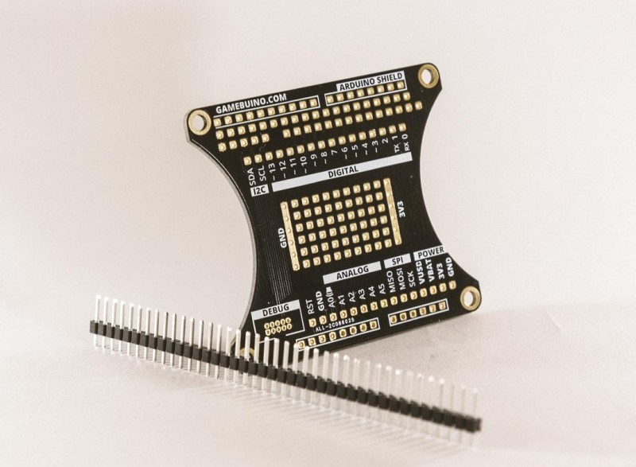

# Hardware of Gamebuino META

[Back to Home](./../../README.MD) | [Français](README-FR.MD) | Go to Reference of Gamebuino META *COMMING SOON*

## Overview

The Gamebuino META allows gamers to enjoy their favorite pixelated games on a compact console. It also provides the opportunity to learn how to program their own games. The Gamebuino META easily fits in your pocket, offers access to a plethora of free games, and has enough battery life to last an entire day of non-stop gaming. The SD card can hold more games than you can possibly play, and switching between games takes just a few seconds.

## Specifications

- Dimensions: 105mmx54mmx17mm
- Microcontroller: ATSAMD21, 32-bit ARM Cortex M0+, 256KB flash, 32KB RAM (same as the Arduino Zero)
- Display: 1.8", 80x64px RGB 16-bit color display (or 160x128px, 16 indexed colors). Default 25 frames per second, up to 50FPS.
- Battery: 900mAh, charged via a micro USB B port (like many phones).
- Backlights: 8 independently controllable RGB LEDs for cool lighting effects in your hands!
- Buttons: 8 buttons like D-pad, A, B, Home, Menu.
- Sound: 10-bit DAC, multi-channel 8-bit with WAV playback, 2.5W class-D audio amp, 3.5mm audio jack, 1W speaker.

## How to Use the Gamebuino

- Power: The switch that allows you to turn your console on and off.
- SD Card: The micro SD memory card where you store all games using the provided USB adapter.
- Audio Jack: The 3.5mm audio jack for connecting your headphones and speakers. Avoid listening too loudly.
- USB: The micro USB port for creating your games and charging the battery. Compatible with any micro USB charger.
- Reset: Double-click to load the SD card's bootloader (if present), otherwise, the console will enter bootloader mode.
- Button A: Select / Main Action
- Button B: Cancel / Secondary Action
- Menu: Game-specific menu, can be used to access the inventory, map, etc.
- Home: Exit the game, adjust volume and lighting effects, take screenshots.

## Programming

Your console is not just designed for gaming; it's also a creative tool. You can program your own games in **C++**! Setting up the environment is easy, and the possibilities for game development are endless. Creating games for the Gamebuino META is for everyone, from beginners to experts. You can also use **CircuitPython** and/or **MicoJS** to create your games.

- [MicoJS IDE](https://micojs.github.io)

## Backpacks 

On the back of your Gamebuino, you'll find a series of input and output pins. These are all Arduino pins, allowing you to do electronics projects with your console. Here is the pin layout:

If needed, feel free to print this for handy reference ;)

### Developer Backpack

We also offer a backpack for making backpacks! It's called the 'Developer Backpack'.

This simple extension allows you to separate all the pins on the back, making them easily accessible. This backpack also allows you to solder directly onto your Gamebuino. It's compatible with Arduino Shields.

#### Caution with 3.3 Volts!

The Gamebuino operates at 3.3 volts; do not connect a 5-volt power source. If you're adding your own modules, ensure they are compatible with 3.3 volts.

### Create Your Own Backpack

So you've had an idea for a backpack. Then, you've created it using the Developer Backpack. You've tested it, improved it, and now what? You could make your own printed circuit board to directly attach to your Gamebuino. You might even sell it. We want to help you create, so here are some files to assist you:

- [PDF Resource: Skin template](./../../pdf/meta/around-meta/skin_template.PDF)
- [PDF Resource: Backpack template](./../../pdf/meta/around-meta/backpack_template.PDF)

## General information

Created at October 20, 2023 from french official page
