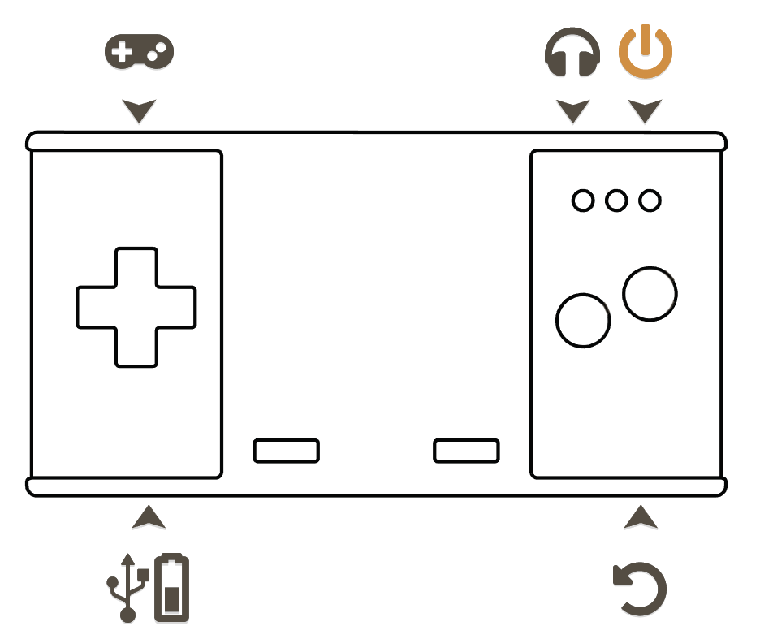
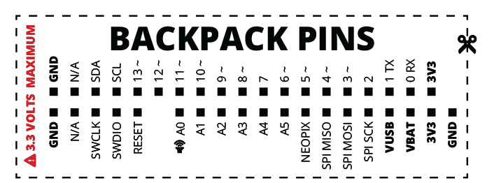
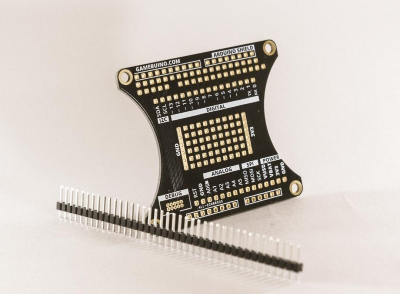

# Fiche technique de la Gamebuino META

[Retour à l'accueil](./../../README.MD) | [English](README-EN.MD) | Voir la documentation de la META *Prochainement*

## Vue d'ensemble

La Gamebuino META permet aux joueurs de jouer aux jeux pixelisés qu'ils aimaient sur une console compacte. Ils peuvent aussi apprendre à programmer leurs propres jeux. La Gamebuino META peux se glisser dans la poche, elle permet de jouer à des tonnes de jeux gratuits, et a assez de charge pour tenir une journée complète non-stop. La carte SD peut contenir plus de jeux que tu ne sera capable d'en jouer, et passer d'un jeu à un autre se fait en quelques secondes.

## Spécifications

- Dimensions : 105mm x 54mm x 17mm
- Microcontroller : ATSAMD21, 32bit ARM Cortex M0+, 256KB flash, 32KB RAM (même que l'Arduino Zero)
- Affichage : 1.8", 80x64px RGB 16bit affichage couleur (ou 160x128px, 16 couleurs indexées). 25 images par second par défaut, jusqu'à 50FPS.
- Batterie : 900mAh, chargé avec un port micro USB B (comme beaucoup de téléphones).
- Lumières arrières : 8 DEL RGB indépendamment contrôlable pour des effet de lumière dans tes mains!
- Buttons : 8 buttons: D-pad, A, B, Home, Menu.
- Son : 10bit DAC, multi-channel 8bit avec lecture de WAV, 2.5W class-D amp audio, audio jack 3.5mm, haut-parleur 1W.

## Comment utiliser la Gamebuino

 

- Alimentation L’interrupteur qui vous permet d’allumer et éteindre votre console.
- Carte SD La carte mémoire micro SD où vous mettez tous les jeux en utilisant l’adaptateur USB fourni. Ajoutez des jeux avec cette méthode.
- Jack audio : La prise audio jack 3.5mm pour brancher vos écouteurs et haut-parleurs. Ne pas écouter trop fort.
- USB : Le port micro USB pour créer vos jeux et charger la batterie. Compatible avec tout chargeur micro USB.
- Reset Double cliquez pour charger le loader de la carte SD (si présent), sinon la console ira en mode bootloader.
- Bouton A : Sélectionner / Action principale
- Bouton B : Annuler / Action secondaire
- Menu : Menu dépendant du jeu, peut être utilisé pour afficher l’inventaire, la carte, etc.
- Home : Sortir du jeu, ajuster le volume et les effets lumineux, faire des captures d’écran.

## Programmation

Ta console n'a pas seulement été conçue en tant que console de jeu. Nous avons pris le temps d'en faire un outil de création. Tu peux programmer tes propres jeux en **C++** ! Mettre en place l'environnement est simple, et les possibilités de jeu sont sans fin. Créer des jeux pour la Gamebuino META est vraiment pour tous, les débutants comme les experts. Tu peux également utiliser **CircuitPython** et/ou **MicoJS** pour créer tes jeux.

- [MicoJS EDI](https://micojs.github.io)

## Backpacks

A l'arrière de ta Gamebuino, il y a une série d'entrées et de sorties. Ce sont tous les pins Arduino. Ils te permettent de faire de l'électronique avec ta console. Voici la disposition des pins:

Si besoin, n'hésite pas à l'imprimer. C'est assez pratique comme information ;)

### Developer backpack

Nous proposons aussi un backpack pour faire des backpacks! On appelle ça le 'Developer backpack'.

Cette simple extension te permet de séparer tous les pins à l'arrière pour qu'ils soient facilement accessibles. Ce backpack permet aussi de souder directement sur ta Gamebuino. Il est compatible avec les Arduino Shields.

### Créer ton propre backpack

Donc tu as eu une idée pour un backpack. Ensuite, tu l'as créé à l'aide du Developer Backpack. Tu l'as testé. Tu l'as amélioré. Et maintenant? Tu pourrais faire ton propre circuit imprimé à placer directement sur ta Gamebuino. Peut-être même le vendre. Nous voulons t'aider à créer, donc voici quelques fichiers qui t'aiderons :)

- [Ressource PDF : modèle Skin](./../../pdf/meta/around-meta/skin_template.PDF)
- [Ressource PDF : modèle Backpack](./../../pdf/meta/around-meta/backpack_template.PDF)

## Information générale

Extraction, avec améliorations, du 20 Octobre 2023
